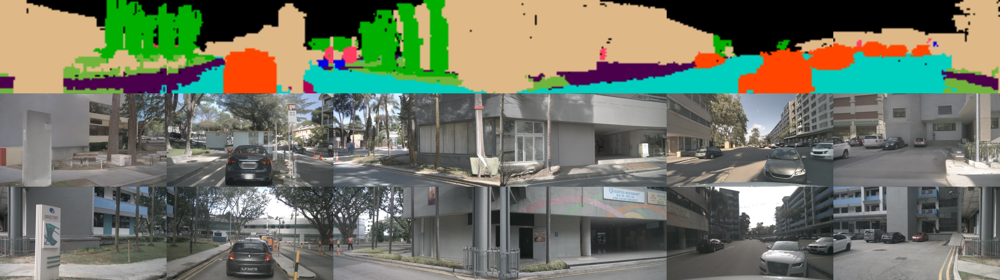

# SyntheOcc

> SyntheOcc: Synthesize Geometric-Controlled Street View Images through 3D Semantic MPIs <br>
> [Leheng Li](https://len-li.github.io), Weichao Qiu, Yingjie Cai, Xu Yan, Qing Lian, Bingbing Liu, Ying-Cong Chen

SyntheOcc is a project focused on synthesizing image data under geometry control (occupancy voxel). This repository provides tools and scripts to process, train, and generate synthetic image data in the nuScenes dataset, using occupancy control.
#### [Project Page](https://len-li.github.io/syntheocc-web) | [Paper](https://arxiv.org/) | [Video](https://len-li.github.io/syntheocc-web/videos/teaser-occedit.mp4) | [Checkpoint](https://huggingface.co/lilelife/SyntheOcc)


## Table of Contents

  - [Installation](#installation)
  - [Prepare Dataset](#prepare-dataset)
  - [Prepare Checkpoint](#prepare-checkpoint)
  - [Train](#train)
  - [Inference](#inference)


## Installation

To get started with SyntheOcc, follow these steps:

1. **Clone the repository:**
   ```bash
   git clone https://github.com/Len-Li/SyntheOcc.git
   cd SyntheOcc
   ```

2. **Set up a environment :**
   ```bash
   pip install torch torchvision transformers
   pip install diffusers==0.26.0.dev0 
   # We use a old version of diffusers, please take care of it.
   ```


## Prepare Dataset

To use SyntheOcc, follow the steps below:

1. **Download the NuScenes dataset:**
   - Register and download the dataset from the [NuScenes website](https://www.nuscenes.org/nuscenes).
   - Download the [train](https://github.com/JeffWang987/OpenOccupancy/releases/tag/train_pkl)/[val](https://github.com/JeffWang987/OpenOccupancy/releases/tag/val_pkl) pickle files from OpenOccupancy and put them in `data/nuscenes` folder.


    After preparation, you will be able to see the following directory structure:  

    ```
    SyntheOcc/
    ├── data/
    │   ├── nuscenes/
    │   │   ├── samples/
    │   │   ├── sweeps/
    |   |   ├── v1.0-trainval/
    |   |   ├── nuscenes_occ_infos_train.pkl
    |   |   ├── nuscenes_occ_infos_val.pkl
    ```
2. **Download occupancy annotation from [SurroundOcc](https://github.com/weiyithu/SurroundOcc/blob/main/docs/data.md)**

    You need to generate the high resolution 0.2m occupancy from mesh vertices and put them in `data/nuscenes` folder.

    You can also download the 0.5m occupancy. The precision may be limited compared with 0.2m.


3. **Run the script to convert occupancy to 3D semantic multiplane images:**
   ```bash
   torchrun utils/gen_mtp.py
   ```
   It will generate the 3D semantic MPI and save them in `data/nuscenes/samples_syntheocc_surocc/` folder.

## Prepare Checkpoint
Our model is based on [stable-diffusion-v2-1](https://huggingface.co/stabilityai/stable-diffusion-v2-1). Please put them at `./SyntheOcc/ckp/`.

Our checkpoint of SyntheOcc is released in [huggingface](https://huggingface.co/lilelife/SyntheOcc). If you want to use our model to run inference. Please also put them at `./SyntheOcc/ckp/`.

## Train 

   ```bash
   bash train.sh
   ```
The details of the script are as follows:
```bash
export WANDB_DISABLED=True
export HF_HUB_OFFLINE=True

export MODEL_DIR="./ckp/stable-diffusion-v2-1"

export EXP_NAME="train_syntheocc"
export OUTPUT_DIR="./ckp/$EXP_NAME"
export SAVE_IMG_DIR="vis_dir/$EXP_NAME/samples"
export DATA_USED="samples_syntheocc_surocc"

accelerate launch --gpu_ids 0, --num_processes 1  --main_process_port 3226  train.py \
    --pretrained_model_name_or_path=$MODEL_DIR \
    --output_dir=$OUTPUT_DIR \
    --width=800 \
    --height=448 \
    --learning_rate=2e-5 \
    --num_train_epochs=6 \
    --train_batch_size=1 \
    --mixed_precision="fp16" \
    --num_validation_images=2 \
    --validation_steps=1000 \
    --checkpointing_steps=5000 \
    --checkpoints_total_limit=10 \
    --ctrl_channel=257 \
    --enable_xformers_memory_efficient_attention \
    --report_to='wandb' \
    --use_cbgs=True \
    --mtp_path='samples_syntheocc_surocc' \
    --resume_from_checkpoint="latest" 
```

The training process will take 1~2 days to complete, depending on the hardware. We use a fixed batchsize=1, image resolution = (800, 448), which will take 25GB memory for each GPU.

## Inference 

```bash
bash infer.sh
```
You will find generated images at `./ckp/$EXP_NAME/samples`. The image is shown as follows:



## Acknowledgment
Additionally, we express our gratitude to the authors of the following opensource projects:

- [SurroundOcc](https://github.com/weiyithu/SurroundOcc) (Occupancy annotation)
- [OpenOccupancy](https://github.com/JeffWang987/OpenOccupancy) (Occupancy annotation)
- [MagicDrive](https://github.com/cure-lab/MagicDrive) (Cross-view and cross-frame attention implementation)
- [Diffusers controlnet example](https://github.com/huggingface/diffusers/tree/main/examples/controlnet) (Diffusion model implementation)


## BibTeX

```bibtex
@inproceedings{li2024SyntheOcc,
              title={SyntheOcc: Synthesize Geometric Controlled Street View Images through 3D Semantic MPIs},
              author={Li, Leheng and Qiu, Weichao and Chen, Ying-Cong et.al.},
              booktitle={arxiv preprint},
              year={2024}
            }
```

This project is licensed under the MIT License - see the [LICENSE](LICENSE) file for details.


